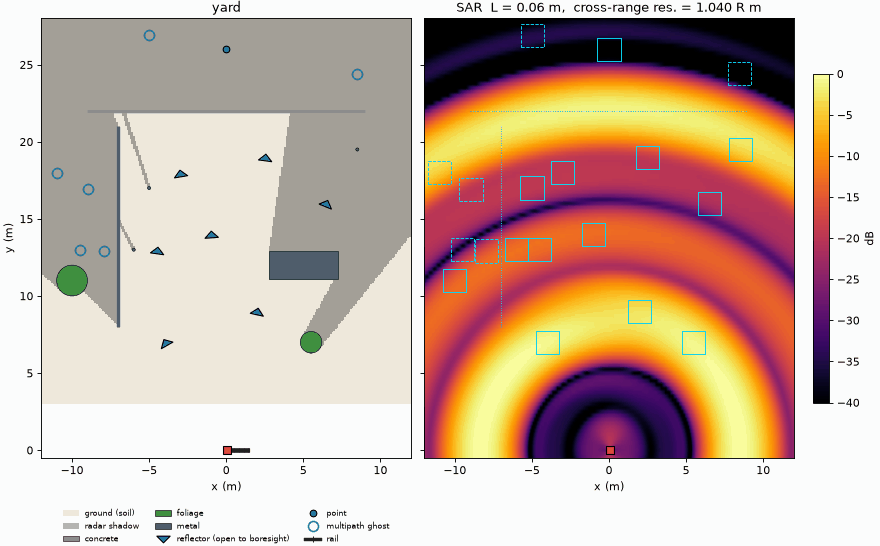

# canny-valley

Linux/USB/Python control and signal processing for the Quonset Microwave
QM-RDK 2.4 GHz FMCW/CW radar demonstration kit, replacing the vendor's
Windows GUI and MATLAB scripts and adding rail SAR imaging.



Simulated scan of the built-in `yard` scene (`qmrdk sar demo --scene yard`):
the scene with its radar shadows and multipath ghosts (left) and the
backprojected SAR image as the sled moves along the 1.5 m rail (right),
focusing from range rings to resolved targets as the aperture grows.

Control and data are over USB only; the board's Bluetooth link is not used.
The USB driver ([docs/driver.md](docs/driver.md)) configures, captures and
keeps the RF off outside captures; every board command also runs against a
simulated board with `--sim`. The sled driver ([docs/sled.md](docs/sled.md))
steps the radar along the rail for scans and calibration steps 3 and 4, on
hardware or against the simulated board and scene; `firmware/sled` is the
sled controller's Arduino firmware, built, tested and flashed with
`docker/firmware.Dockerfile`.

## Install

```
pip install -e .[dev]
```

or build `docker/Dockerfile`.

## Usage

```
qmrdk list                                                    # boards and *IDN?
qmrdk info                                                    # settings, lock, temperature, status, errors
qmrdk set --f0 2.4 --f1 2.5 --ramp-time 8 --type triangle     # configure; leaves the sweep running
qmrdk rf off                                                  # stop the sweep (RF off)
qmrdk scpi 'SYST:TEMP?'                                       # guarded raw command
qmrdk capture --frames 10 --n 4096 --out artifacts/rec.npz    # frames into a recording
qmrdk capture --frames 1200 --interval 1 --temperature --out artifacts/static.npz
qmrdk drift artifacts/static.npz --cal cal.json --out artifacts/drift.png   # phase drift vs time and temperature
qmrdk sar demo --scene yard --out artifacts/yard.png          # simulated scan, calibration, animated truth vs SAR
qmrdk sar scan --sim --scene yard --out artifacts/scan.npz    # simulated scan recording
qmrdk sar scan --length 1.5 --out artifacts/scan.npz          # board on USB, sled controller ($QMRDK_SLED or USB id)
qmrdk sar scan --manual --length 1.5 --out artifacts/scan.npz # board on USB, radar moved by hand when prompted
qmrdk sar image artifacts/scan.npz --cal cal.json --scene yard --out artifacts/scan.png
qmrdk sar image artifacts/scan2.npz --cal cal.json --reference artifacts/scan.npz --out artifacts/change.png  # change image
qmrdk calib sim --cal cal.json                                # full calibration procedure on the simulated board
qmrdk calib {timing,guard,reflector,repeat} --sim --cal cal.json
qmrdk calib timing --frames-file A.npz                        # on the board, first position
qmrdk calib timing --frames-file B.npz --pair A.npz --cal cal.json   # after moving the radar ~3 cm
```

Sweep options `--f0`, `--f1` (GHz) and `--ramp-time` (ms) select the
simulated sweep. Scenes are JSON files; built-in scenes are in
`qmrdk/scenes/`.

## Documents

* [Implementation plan](docs/implementation-plan.md)
* [USB control protocol](docs/protocol.md)
* [USB driver](docs/driver.md)
* [Sled controller](docs/sled.md)
* [Signal processing](docs/signal-processing.md)
* [Simulation model](docs/simulation.md)
* [Calibration procedure](docs/calibration.md)
* [Board notes](docs/hardware.md)

Vendor documentation ([Quonset Microwave QM-RDKIT](https://www.quonsetmicrowave.com/QM-RDKIT-p/qm-rdkit.htm)):
[user manual](https://www.quonsetmicrowave.com/v/vspfiles/Manuals/QM-RDKIT/QM-RDK%20User%20Manual%20REV%201.2.0.pdf),
[quick start](https://www.quonsetmicrowave.com/v/vspfiles/Manuals/QM-RDKIT/16.08.10%20QM-RDK%20Quickstart.pdf),
[lesson guide](https://www.quonsetmicrowave.com/v/vspfiles/Manuals/QM-RDKIT/16.09.28%20QM-RDK%20Lesson%20Guide.pdf),
[assembly diagram](https://www.quonsetmicrowave.com/v/vspfiles/Manuals/QM-RDKIT/QM4004_assembly_diagram.pdf).

## License

MIT, see [LICENSE](LICENSE).
